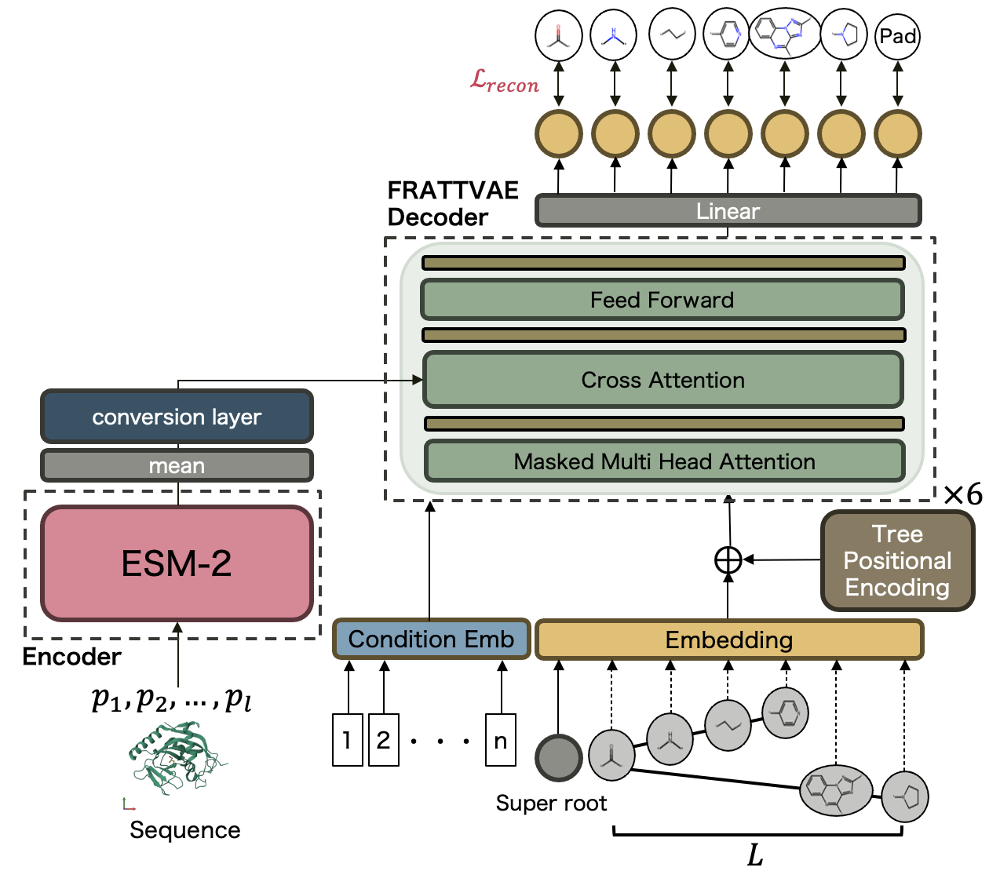

# FRATTPRO
## What is FRATTPRO?

<br>
FRATTPRO is a Transformer-based generative model designed to create small-molecule compounds conditioned on a target protein and a desired binding affinity. The model integrates pretrained representations from protein and molecular domains—leveraging [ESM2](https://github.com/facebookresearch/esm) for protein encoding and [FRATTVAE](https://github.com/slab-it/FRATTVAE) for molecular latent modeling—into a unified architecture.

During training, FRATTPRO learns the relationship between proteins, compounds, and their binding strengths using docking scores computed by [SMINA](https://sourceforge.net/projects/smina/), which is employed to evaluate protein–ligand binding affinity. By aligning the joint embedding space with these SMINA-derived signals, the model captures how molecular structures influence protein–ligand interactions.

Once trained, FRATTPRO enables inverse design: given a protein and a target binding score, it generates candidate compounds that are predicted to achieve the specified level of interaction. This makes FRATTPRO a useful tool for structure-based drug design, allowing researchers to efficiently explore chemical space guided by protein-specific binding requirements.

In benchmark tasks for generating optimized ligands against unseen test proteins, FRATTPRO achieved better docking scores than prior methods. In addition, the generation process is more efficient, enabling faster discovery of protein-binding compounds. By specifying physicochemical properties as part of the input, the model can also generate compounds that satisfy desired property constraints. Furthermore, through fine-tuning on datasets of known tankyrase inhibitors, FRATTPRO successfully proposed novel compounds with improved docking scores compared to known inhibitors.


## Usage
### Build FRATTPRO environment
1. Clone the required repositories<br>
    Prepare this repository together with [FRATTVAE](https://github.com/slab-it/FRATTVAE) and [SMINA](https://github.com/mwojcikowski/smina) under the same parent directory.
    ```
    <home_directory>
    ├── FRATTPRO
    ├── FRATTVAE
    └── SMINA
    ```
2. Preparing the training datasets<br>
    The allData.zip file is included in the datasets directory. Extract allData.zip in the same directory before running the code.
    ```
    <home_directory>
    └── FRATTPRO
        └── datasets
            ├── BindingDB_AlphaDrug_addTanky.csv 
                # For Tankyrase ligand design
            └── BindingDB_AlphaDrug.csv 
                # Benchmark dataset for AlphaDrug
    ```

3. Build the environment with Docker<br>
    The repository includes a devcontainer setup that can be used as the base environment for preprocessing, training, and testing.
    ```bash
    cd <home_directory>/FRATTPRO/.devcontainer/.
    ```
    ```bash
    docker build . --network=host -t <IMAGE NAME>
    ```
    ```bash
    docker run -itd --runtime=nvidia --shm-size 32g -t <CONTAINER NAME> <IMAGE ID>
    ```
4. Build SMINA inside the Docker container<br>
    After entering the container, build SMINA so that docking-based evaluation is available in the same environment.
    ```bash
    docker attach <CONTAINER NAME> #please attach the docker container
    ```
    ```bash
    cd <home_directory>/smina-code/.
    ```
    ```bash
    mkdir build
    ```
    ```bash
    cd build
    ```
    ```bash
    cmake -D CMAKE_PREFIX_PATH=$CONDA_PREFIX ..
    ```
    ```bash
    cmake -D OPENBABEL_DIR=${HOME}/conda/envs/FRATTPRO ..
    ```
    ```bash
    make -j4
    ```
    ```bash
    ./smina --version # check the version
    ```

### Preparation
This step prepares the dataset and defines the training conditions for FRATTPRO. Before running preprocessing, make sure your dataset includes columns for the compound identifier, protein amino acid sequence, SMILES string, and any property values you want to use as conditioning inputs.
1. (option) Standardize SMILES<br>
    If your dataset does not already contain standardized SMILES, you can standardize them in advance with FRATTVAE.
    ```bash
    cd <home_directory>/FRATTVAE/scripts/.
    ```
    ```bash
    ./exec_standardize.sh
    ```

2. Set the preprocessing conditions<br>
    First, update the settings in this file as needed.
    ```
    <home_directory>/FRATTPRO/scripts/preprocessing.sh
    ```
    This script defines the input dataset, ESM model, pretrained FRATTVAE path, and preprocessing-related hyperparameters. After editing it, run the script.
    ```bash
    cd <home_directory>/FRATTPRO/scripts/.
    ```
    ```bash
    ./preprocessing.sh
    ```

### Training
1. (option) Pretraining of FRATTVAE<br>
    If you want to use a pretrained FRATTVAE model, please follow the FRATTVAE guide and train it first. After that, the folder structure should look like this.
    ```
    <home_directory>
    ├── FRATTRPO
    └── FRATTVAE
        └── results
            └── <pretrained_frattvae_model>
    ```
2. Train<br>
    First, edit the settings in this file as needed.
    ```
    <home_directory>/FRATTPRO/scripts/train.sh
    ```
    This script specifies the preprocessed result directory, an optional pretrained FRATTPRO checkpoint, and the GPU settings for training. Then, run the script.
    ```bash
    ./train.sh
    ```


### Test
For comparison with previous work, [Alpha Drug](https://github.com/CMACH508/AlphaDrug), the test data can be obtained from [here](https://github.com/CMACH508/AlphaDrug/tree/main/data/test_pdbs).

1. Prepare test data from AlphaDrug<br>
    You may also use your own data as long as the folder structure is the same.
    ```
    <home_directory>
    └── FRATTPRO
        └── PDB
            ├── pdb_tankyrase
            └── test_pdbs  //from AlpaDrug/data/test_pdbs
    ```
2. Test<br>
    First, edit the settings in this file as needed.
    ```
    <home_directory>/FRATTPRO/scripts/test.sh
    ```
    This script expects the trained model directory, the PDB directory, and a condition table for ligand generation. Then, run the script.
    ```bash
    ./test.sh
    ```


## Citation
### FRATTVAE
```bibtex
@article{Inukai2025,
    author={Inukai, Tensei
    and Yamato, Aoi
    and Akiyama, Manato
    and Sakakibara, Yasubumi},
    title={Leveraging tree-transformer VAE with fragment tokenization for high-performance large chemical model generation},
    journal={Communications Chemistry},
    year={2025},
    month={Aug},
    day={05},
    volume={8},
    number={1},
    pages={228},
    issn={2399-3669},
    doi={10.1038/s42004-025-01640-w},
    url={https://doi.org/10.1038/s42004-025-01640-w}
}
```
### AlphaDrug
```bibtex
@article{10.1093/pnasnexus/pgac227,
    author = {Qian, Hao and Lin, Cheng and Zhao, Dengwei and Tu, Shikui and Xu, Lei},
    title = {AlphaDrug: protein target specific de novo molecular generation},
    journal = {PNAS Nexus},
    volume = {1},
    number = {4},
    pages = {pgac227},
    year = {2022},
    month = {10},
    issn = {2752-6542},
    doi = {10.1093/pnasnexus/pgac227},
    url = {https://doi.org/10.1093/pnasnexus/pgac227},
    eprint = {https://academic.oup.com/pnasnexus/article-pdf/1/4/pgac227/48849689/pgac227.pdf},
}
```
### ESM2
```bibtex
@article{lin2023evolutionary, 
    title = {Evolutionary-scale prediction of atomic-level protein structure with a language model}, 
    author = {Zeming Lin and Halil Akin and Roshan Rao and Brian Hie and Zhongkai Zhu and Wenting Lu and Nikita Smetanin and Robert Verkuil and Ori Kabeli and Yaniv Shmueli and Allan dos Santos Costa and Maryam Fazel-Zarandi and Tom Sercu and Salvatore Candido and Alexander Rives }, 
    journal = {Science}, 
    volume = {379}, 
    number = {6637}, 
    pages = {1123-1130}, 
    year = {2023}, 
    doi = {10.1126/science.ade2574}, 
    URL = {https://www.science.org/doi/abs/10.1126/science.ade2574}, 
    note={Earlier versions as preprint: bioRxiv 2022.07.20.500902}, }
```

### SMINA
```bibtex
@article{Koes2013,
    author={Koes, David Ryan
    and Baumgartner, Matthew P.
    and Camacho, Carlos J.},
    title={Lessons Learned in Empirical Scoring with smina from the CSAR 2011 Benchmarking Exercise},
    journal={Journal of Chemical Information and Modeling},
    year={2013},
    month={Aug},
    day={26},
    publisher={American Chemical Society},
    volume={53},
    number={8},
    pages={1893-1904},
    issn={1549-9596},
    doi={10.1021/ci300604z},
    url={https://doi.org/10.1021/ci300604z}
}
```
